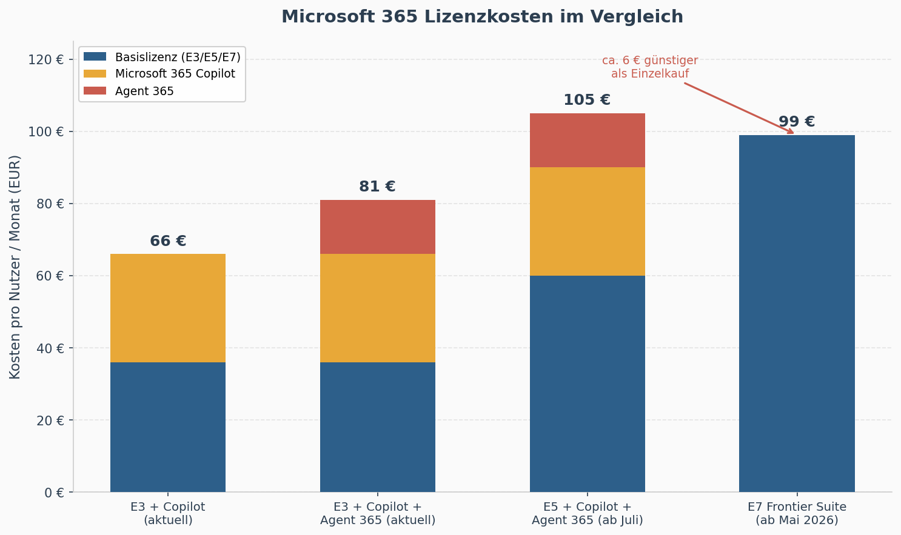

# Microsoft 365 E7: Kosten, Inhalte und Preisvergleich der neuen Frontier Suite (2026)

**Autor: Martin Lang | Copilotenschule.de | März 2026**

---

99 Euro pro Nutzer und Monat -- das ist der Preis, den Microsoft ab dem 1. Mai 2026 für sein neues Spitzenprodukt verlangt: Microsoft 365 E7, offiziell „The Frontier Suite" genannt. Damit schafft Microsoft erstmals seit der Einführung von E5 im Jahr 2015 eine neue Enterprise-Lizenzstufe. Wer nur die Zahl sieht, könnte das als weiteres Marketing-Upgrade abtun. Aber E7 ist mehr als ein neuer Preispunkt. Es markiert einen strategischen Wendepunkt in der Art, wie Microsoft KI im Unternehmensalltag verankern will -- und es zwingt IT-Entscheider, ihre Lizenzstrategie grundlegend zu überdenken.

## Was ist in Microsoft 365 E7 enthalten? Die Frontier Suite im Detail

Microsoft bündelt mit E7 vier bisher eigenständige Produkte in einem Paket. Das klingt nach dem üblichen Konsolidierungsspiel, das Redmond seit Jahren perfektioniert -- aber die Zusammenstellung verrät eine klare strategische Richtung.

Die E7-Suite enthält zunächst das vollständige **Microsoft 365 E5**, also den bisherigen Spitzentarif mit sämtlichen Produktivitäts-, Sicherheits- und Compliance-Funktionen inklusive Power BI Pro, Teams Phone und der vollständigen Defender-Suite. Dazu kommt **Microsoft 365 Copilot**, die KI-Assistenz, die in Word, Excel, PowerPoint, Outlook und Teams eingebettet ist -- bislang ein separates Add-on für 30 Euro. Neu im Paket ist **Agent 365**, Microsofts Governance-Plattform für KI-Agenten, mit der Unternehmen ihre Agenten über eine zentrale Kontrollschicht überwachen, absichern und steuern. Und schließlich enthält E7 die vollständige **Microsoft Entra Suite** für Identitäts- und Zugriffsmanagement sowie erweiterte Funktionen in Defender, Intune und Purview.

Das folgende Schaubild von Microsoft zeigt die Bestandteile der E7-Lizenz im Vergleich zu den Einzelkomponenten:

*Abbildung: „Microsoft 365 E7: The Frontier Suite" -- Funktionsvergleich aller enthaltenen Komponenten und deren Einzelpreise. Quelle: [Microsoft Official Blog](https://blogs.microsoft.com/blog/2026/03/09/introducing-the-first-frontier-suite-built-on-intelligence-trust/)*

Wer sich die Tabelle genau ansieht, erkennt den entscheidenden Unterschied zu E5: E7 ist nicht einfach E5 mit einem KI-Aufpreis. Es ist der erste Microsoft-Tarif, in dem KI-Funktionalität und Agent-Management als integrale Bestandteile behandelt werden -- nicht als nachträglich hinzubuchbare Extras. Copilot Studio mit dem Agent Builder, Work IQ als kontextsensitive Intelligence-Schicht, die auf Unternehmensdaten und Drittanbieter-Konnektoren zugreift, und das komplette Agent-365-Management: All das gibt es in dieser Kombination nur im E7-Paket.

## Microsoft 365 E7 Kosten: Der vollständige Preisvergleich E3 vs. E5 vs. E7

Die Preisfrage ist weniger trivial, als es die runden 99 Euro vermuten lassen. Denn die Antwort hängt stark davon ab, von welcher Lizenz aus man rechnet -- und ob man die Microsoft 365 Preiserhöhung ab Juli 2026 bereits einkalkuliert.

**Szenario 1: Unternehmen mit E5-Lizenz.** Wer bereits E5 im Einsatz hat, sieht ab Juli 2026 folgende Einzelkosten: E5 steigt auf 60 Euro (aktuell ca. 57 Euro), Copilot liegt bei 30 Euro, die Entra Suite bei 12 Euro und Agent 365 bei 15 Euro. In Summe wären das 117 Euro pro Nutzer und Monat. Die E7-Lizenz für 99 Euro spart also rund 18 Euro monatlich, was einem Rabatt von etwa 15 Prozent entspricht. Gartner beziffert den Discount je nach Berechnungsbasis auf 13,2 Prozent. Bei 500 Nutzern ergibt das eine Ersparnis von über 100.000 Euro im Jahr -- kein gewaltiger Nachlass pro Kopf, aber in der Masse spürbar.

*Abbildung: Monatliche Kosten pro Nutzer in den gängigsten Lizenz-Szenarien. Die E7-Lizenz wird erst im Vergleich zur vollen Einzelkomponenten-Kombination ab Juli 2026 wirtschaftlich attraktiv.*

**Szenario 2: Unternehmen mit E3-Lizenz -- die Mittelstandsrechnung.** E3 kostet aktuell rund 36 Euro, ab Juli 2026 dann 39 Euro. Wer Copilot dazubucht, landet bei 69 Euro. Mit Agent 365 obendrauf sind es 84 Euro. Der Sprung auf E7 mit 99 Euro bedeutet dann 15 Euro mehr pro Nutzer -- aber auch die ernste Frage, ob man die erweiterten Security- und Compliance-Features von E5 tatsächlich braucht. Viele mittelständische Unternehmen setzen E5-exklusive Features wie Advanced Threat Protection, eDiscovery Premium oder Insider Risk Management schlicht nicht ein, weil ihnen die personellen Ressourcen oder die regulatorische Pflicht fehlt. Für diese Unternehmen ist E7 kein preiswertes Bundle, sondern ein teurer Aufpreis für Funktionen, die niemand konfiguriert.

## Was ist Agent 365? Die Governance-Plattform für KI-Agenten erklärt

Was E7 konzeptionell von einem reinen Mengenrabatt unterscheidet, ist Agent 365. Während Copilot inzwischen vielen IT-Entscheidern und Geschäftsführern ein Begriff ist, bleibt Agent 365 für die meisten noch abstrakt. Die Grundidee: Sobald Unternehmen nicht mehr nur einen einzelnen KI-Assistenten nutzen, sondern mehrere autonome Agenten im Einsatz haben -- etwa für Rechnungsverarbeitung, IT-Support-Tickets oder die Qualifizierung von Vertriebsleads --, brauchen sie ein zentrales System, das diese digitalen Mitarbeiter genauso verwaltet wie menschliche. Agent 365 liefert genau das: eine Agent Registry als zentrales Verzeichnis, in dem jeder Agent eine eindeutige Identität über Microsoft Entra erhält, dazu Monitoring in Echtzeit, Sicherheitsrichtlinien und Lifecycle-Management über das Microsoft Admin Center, Defender und Purview.

Gartner bewertet Agent 365 aktuell allerdings als „work in progress" und hält den eigenständigen Preis von 15 Euro pro Nutzer für schwer zu rechtfertigen, solange der Funktionsumfang noch im Aufbau ist. Das ist ein fairer Punkt. Wer heute noch keine KI-Agenten im produktiven Einsatz hat, zahlt mit E7 im Grunde für ein Zukunftsversprechen. Wer dagegen schon Agenten baut oder den Aufbau konkret plant, bekommt mit E7 eine Governance-Struktur, die in der Microsoft-Welt sonst schlicht nicht existiert -- und die mit dem eigenständigen Agent-365-Add-on für 15 Euro monatlich auch separat verfügbar ist.

## Microsoft 365 Preiserhöhung Juli 2026: Warum E7 im Kontext der neuen Preise zu sehen ist

Man kann über die E7-Preisgestaltung im Detail streiten. Was man dabei nicht übersehen darf, ist die parallele Preiserhöhung, die Microsoft zum 1. Juli 2026 für das gesamte kommerzielle Microsoft 365-Portfolio angekündigt hat. Die Erhöhungen betreffen nahezu alle Tarife: Business Basic steigt um 17 Prozent, Business Standard um 16 Prozent, E3 um rund 8 Prozent, E5 um gut 5 Prozent. In Euro-Werte übersetzt bedeutet das: E3 geht von ca. 36 auf 39 Euro, E5 von ca. 57 auf 60 Euro, Copilot bleibt bei 30 Euro.

Das verändert die relative Attraktivität von E7 spürbar. Wer heute E5 plus Copilot separat kauft, zahlt rund 87 Euro. Ab Juli werden es 90 Euro sein. Nimmt man Agent 365 und Entra Suite dazu, landet man bei 117 Euro. E7 für 99 Euro wird dann zum deutlich günstigeren Gesamtpaket -- vorausgesetzt, man nutzt tatsächlich alles, was darin enthalten ist.

Copilot war bisher ein optionales Add-on: etwas, das man dazubuchen konnte, wenn man wollte. E7 dreht diese Logik um. KI ist hier kein Zusatz mehr, sondern integraler Bestandteil des Betriebssystems für Wissensarbeit. Agent-Management ist kein Experiment, sondern eine Enterprise-Funktion mit eigenem SKU.

Ein Detail am Rande, das leicht untergeht: Copilot unterstützt in der E7-Version neben den OpenAI-Modellen auch Claude von Anthropic. Microsoft bewegt sich damit weg von der Abhängigkeit eines einzelnen KI-Anbieters und bietet Unternehmen eine Modellwahl, die in der bisherigen E5-plus-Copilot-Kombination nicht verfügbar war.

## Lohnt sich Microsoft 365 E7? Entscheidungshilfe für den Mittelstand und Großunternehmen

Microsoft bietet zum E7-Start befristete Einführungsrabatte an: 10 Prozent bei mindestens 10 Lizenzen im Jahresvertrag, 15 Prozent ab 100 Lizenzen. In Kombination mit der EUR-Währungsanpassung vom Februar 2026, bei der Microsoft die europäischen Preise um 7,4 Prozent gesenkt hat, ergibt sich ein interessantes Fenster. Wer zwischen Februar und Juni 2026 abschließt, profitiert von niedrigeren EUR-Preisen und den Einführungsrabatten, bevor die allgemeinen Preiserhöhungen im Juli greifen. Für IT-Einkäufer, die aktuell Enterprise Agreements verhandeln, kann die Kombination aus Währungskorrektur, Einführungsrabatt und dem Umstand, dass EA-Preise erst bei Verlängerung angepasst werden, den effektiven E7-Preis pro Nutzer deutlich drücken.

Microsoft 365 E7 ist kein Pflichtupgrade für jedes Unternehmen. Es ist ein strategisches Bundle, das sich an Organisationen richtet, die drei Voraussetzungen gleichzeitig mitbringen: Sie nutzen bereits E5 oder haben konkreten Bedarf an dessen Security- und Compliance-Funktionen. Sie setzen Copilot produktiv ein oder planen den unternehmensweiten Rollout in den kommenden Monaten. Und sie bauen KI-Agenten oder stehen kurz davor.

Wer zwei dieser drei Kriterien nicht erfüllt, fährt mit E3 plus Copilot deutlich günstiger und kann Agent 365 als Einzellizenz nachbuchen, wenn der Agent-Einsatz tatsächlich spruchreif wird. Gerade für mittelständische Unternehmen, die noch am Anfang ihrer Copilot-Einführung stehen, ist die Kombination aus E3 und dem neuen, günstigeren Copilot Business (ab 21 Euro für Unternehmen unter 300 Nutzern) oft der wirtschaftlichere Einstieg.

Was E7 aber unmissverständlich klarmacht: Microsoft betrachtet KI nicht länger als optionales Zusatzgeschäft, sondern als Kern seiner Enterprise-Plattform. Wer langfristig im Microsoft-Ökosystem plant, sollte E7 nicht als heutigen Kaufentscheid betrachten -- sondern als die Richtung, in die sich die gesamte Lizenzlandschaft bewegt. Die Frage ist nicht ob, sondern wann KI-Governance und Agent-Management zum Standard werden. Und wer Copilot dann produktiv einsetzen will, braucht nicht nur die richtige Lizenz, sondern auch Teams, die wissen, wie man mit KI-Assistenten und Agenten tatsächlich arbeitet.

---

*Martin Lang ist Gründer der [Copilotenschule](https://copilotenschule.de) und begleitet Unternehmen bei der produktiven Einführung von Microsoft 365 Copilot -- von der Lizenzberatung über Copilot-Trainings für Anwender und Führungskräfte bis zur KI-Governance-Strategie.*

---

**Quellen:**

- Microsoft Official Blog: [Introducing the First Frontier Suite built on Intelligence + Trust](https://blogs.microsoft.com/blog/2026/03/09/introducing-the-first-frontier-suite-built-on-intelligence-trust/) (9. März 2026)
- Microsoft 365 Blog: [Advancing Microsoft 365: New capabilities and pricing update](https://www.microsoft.com/en-us/microsoft-365/blog/2025/12/04/advancing-microsoft-365-new-capabilities-and-pricing-update/) (4. Dezember 2025)
- Microsoft: [Microsoft Agent 365 -- The Control Plane for Agents](https://www.microsoft.com/en-us/microsoft-agent-365)
- SAMexpert: [Microsoft 365 E7 Licensing Guide](https://samexpert.com/microsoft-365-e7-licensing-guide/)
- SAMexpert: [Microsoft 365 July 2026 Price Increase -- The Real Cost](https://samexpert.com/microsoft-365-july-2026-price-increase/)
- ComputerBase: [Merkliche Preiserhöhung ab Juli 2026: Microsoft 365 für Geschäftskunden wird teurer](https://www.computerbase.de/news/apps/merkliche-preiserhoehung-ab-juli-2026-microsoft-365-fuer-geschaeftskunden-wird-teurer.95339/)
- TechTarget: [Microsoft 365 E7 adds AI governance; prices draw critiques](https://www.techtarget.com/searchitoperations/news/366639980/Microsoft-365-E7-adds-AI-governance-prices-draw-critiques)
